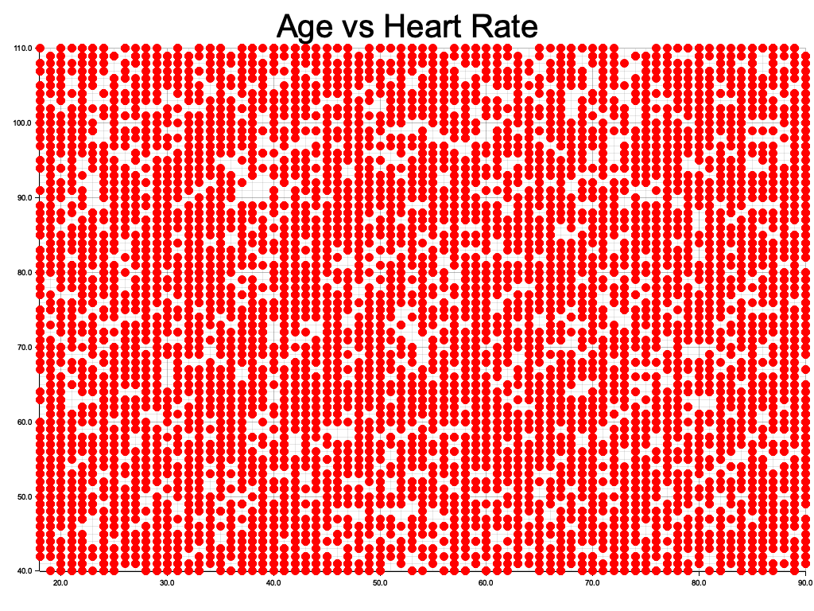

&#8743;  [Start README](../README.md)

#### Basic Scatter Plotting

_Scatter Plotting_ is one of possible plotting types.

<small>**Diagram**: _The plotting sample_</small>

___Polars___ library has no plotting features - using `plotters` instead.